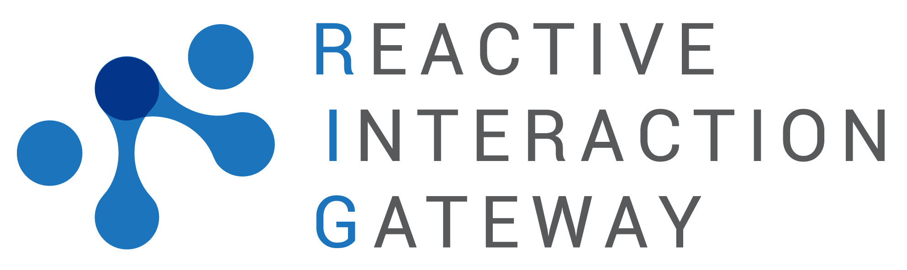

# RIG - Reactive Interaction Gateway

_The missing link between backend and frontend -- stop polling and go real-time!_

Take a look at the [documentation](https://accenture.github.io/reactive-interaction-gateway/docs/intro.html) and get in touch with us on [Slack](https://rig-slackin.herokuapp.com)!

## What does it solve?

- Let RIG take care of client connection state so you don't have to.
- Send events to RIG and have them forwarded to clients based on their event subscriptions.
- Use RIG to forward client requests to backend services.

Built on open standards, RIG is very easy to integrate – and easy to _replace_ – which means low-cost, low-risk adoption. Unlike other solutions, RIG does not leak into your application – no libraries or SDKs required.

For more details take a look at the [documentation](https://accenture.github.io/reactive-interaction-gateway/docs/intro.html).

## Feature Summary

- Easy to use and scalable by design:
  - Supports tens of thousands stable connections per node even on low-end machines.
  - Easy to add additional nodes.
  - Built on the battle-proven [**Erlang/OTP**](http://www.erlang.org/) distribution model.
  - Only uses in-memory data structures - no external dependencies to configure or scale.
- Firewall friendly and future proof using **Server-Sent Events (SSE)**:
  - [HTML5 standard](https://html.spec.whatwg.org/multipage/server-sent-events.html#server-sent-events).
  - Regular HTTP requests, so no issues with proxy servers or firewalls.
  - Connection multiplexing with HTTP/2 out of the box.
  - SSE implementation (browser) keeps track of connection drops and restores the connection automatically.
  - Polyfills available for older browsers.
- WebSocket connections are supported, too.
- HTTP long polling for situations where SSE and WS are not supported.
- Uses the upcoming [**CloudEvents** specification](https://cloudevents.io/).
- Flexible event subscription model based on event types.
- Use existing services for authentication and authorization of users and subscriptions.
- JWT signature verification for APIs as a simple authentication check.
- Session blacklist with immediate session invalidation.

## Getting Started

Take a look at the [getting-started tutorial](https://accenture.github.io/reactive-interaction-gateway/docs/tutorial.html).

### API Documentation

RIG exposes its API documentation on its API endpoint under [/swagger-ui](http://localhost:4010/swagger-ui). For integration into an existing swagger UI, the related JSON document can either be [retrieved at runtime](http://localhost:4010/swagger-ui/rig_api_swagger.json) or [found on disk](./priv/static/rig_api_swagger.json) after compiling RIG at least once.

### Metrics

RIG exposes Metrics in [Prometheus](https://prometheus.io/) format on its API endpoint under [/metrics](http:localhost:4010/metrics)

## Contribute

- **Use issues for everything.**
- For a small change, just send a PR.
- For bigger changes open an issue for discussion before sending a PR.
- PR should have:
  - Test case
  - Documentation (e.g., moduledoc, developer's guide, operator's guide)
  - Changelog entry
- You can also contribute by:
  - Reporting issues
  - Suggesting new features or enhancements
  - Improve/fix documentation

See the [developer's guide](https://accenture.github.io/reactive-interaction-gateway/docs/rig-dev-guide.html) and [CONTRIBUTING.md](./CONTRIBUTING.md) for details.

## License

The Reactive Interaction Gateway [(patent: granted)](https://patents.google.com/patent/US10193992B2/en) is licensed under the Apache License 2.0 - see
[LICENSE](LICENSE) for details.

## Acknowledgments

The Reactive Interaction Gateway is sponsored and maintained by [Accenture](https://accenture.github.io/).

Kudos to these awesome projects:

- Elixir
- Erlang/OTP
- Phoenix Framework
- Brod
- Distillery

.
