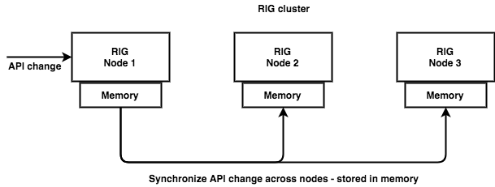

Synchronization of APIs in API Gateway works out of the box and happens almost instantly. It's important to mention that as everything we store in RIG, also API definitions are stored in memory, thus it operates very fast, but it's not strongly consistent. Image below describes as you do any change to API definition on single node (doesn't matter which one) it will eventually spread to other nodes and save in memory.

## Initial startup

Very first synchronization happens on RIG startup. In fact it's enough if one node has JSON file with API definitions and it will be automatically spread among other nodes. In case you would use different JSON files with different APIs cluster will eventually synchronize all APIs -- so you'll end up have all APIs on each node. JSON file is used only at startup, after that it doesn't have any impact on API definitions (e.g. in case it would be changed, deleted, ...). Conflicts are resolved using several rules:

1. `ref_number` - describes version of API definition, higher the number -- newer the API and higher the priority in merging process.
1. Data comparison - compares data of API definition -- if it's different, checks the same API also on other nodes. Chooses version that is used on more nodes.
1. If multiple versions of API definition are used evenly between nodes then it compares timestamps and chooses the newer one.

## Runtime changes

You can change API definitions also during runtime via REST API. Again it's enough to change API on single node and changes will be spread among the nodes. For this type of synchronization we use the same rules as above.
