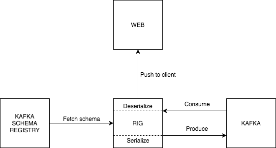

We support [Apache Avro](https://avro.apache.org/) and standard JSON (de)serialization of events for producer as well as for consumer. This is working together with [Cloud Events specification](https://github.com/cloudevents/spec) (versions `0.1` and `0.2`). To make both of these worlds work we are utilizing Kafka headers introduced in version `0.11`. As Cloud Events specify there are 2 modes how to make this combination work. Discussion about this topic can be followed on [Github](https://github.com/cloudevents/spec/pull/337/files).

**Structured content mode**

This mode should be used when JSON format is desired, thus no further serialization and deserialization such as Apache Avro.

> ##### KAFKA EVENT HEADERS
>
> ```
> cloudEvent_contentType: "application/json"
> ```
>
> ##### KAFKA EVENT VALUE
>
> ```
> {
>    "specversion" : "0.1",
>    "type" : "com.example.someevent",
>    "data": {},
>    ...
> }
> ```

**Binary content mode**

This mode should be used when further serialization and deserialization is desired (e.g. Apache Avro).

> ##### KAFKA EVENT HEADERS
>
> ```
> cloudEvent_contentType: "avro/binary"
> cloudEvent_specversion: "0.2"
> cloudEvent_type: "com.example.someevent"
> ...
> ```
>
> ##### KAFKA EVENT VALUE
>
> ```
> ... application data ...
> ```

## Apache Avro format

To be compatible across the board Apache Avro is using specific [format](https://docs.confluent.io/current/schema-registry/docs/serializer-formatter.html#wire-format) that needs to be followed.

```bash
# 0 - magic byte
# 1-4 - schema id - this is used by consumer to know which schema to use for deserialization
# 5-... - data

# Example
<0, 0, 0, 0, 1, 5, 3, 8, ...>
```

### Setup



Setup for event (de)serialization if fairly straightforward. Besides classic components like web client, RIG and Kafka it needs also `Kafka Schema Registry`. `Kafka Schema Registry` is place where all schemas are stored and retrieved from. As event is consumed from Kafka, RIG fetches schema, caches it in-memory and does deserialization. After that event is sent to web client (or any other client able to connect via WS/SSE). As for producing, RIG fetches schema, caches it in-memory and serialize event. Then it's sent to Kafka.

### Producer details

- producer evaluates if serializing is turned on by checking `KAFKA_SERIALIZER` environment variable and if it's value is `avro`
- If it is, creates headers for Kafka event by appending `cloudEvents_` prefix for every field besides `data` field
  - **for deep nested values we are using query encoding** since Kafka headers don't support nested values
- after that `data` field is serialized using the schema name (function for getting schemas from registry is cached in-memory)
- producer sends event with created headers and data (in binary format `<<0, 0, 0, 0, 1, 5, 3, 8, ...>>`) to Kafka

> If `KAFKA_SERIALIZER` is not set to `avro` producer sets **only** `cloudEvents_contenttype` or `cloudEvents_contentType` for kafka event

### Consumer details

- when consuming Kafka event RIG checks headers of such event and removes `cloudEvents_` prefix
- based on headers decides cloud events version and content type
- In case content type is `avro/binary`, schema ID is taken from event value and deserialized
- If content type is **not** present RIG checks for Avro format (`<<0, 0, 0, 0, 1, 5, 3, 8, ...>>`) and attempts for deserialization, otherwise event is sent to client as it is without any deserialization

### Example

#### Self consuming

In this example we'll try to communicate with ourselves which is naive, but quick check if producer and consumer works correctly. In nutshell RIG will produce serialized event via proxy and after few moments consume and deserialize it.

```bash
# 1. Start Kafka with Zookeeper and Kafka Schema Registry
KAFKA_PORT_PLAIN=17092 KAFKA_PORT_SSL=17093 HOST=localhost docker-compose -f integration_tests/kafka_tests/docker-compose.yml up -d

# 2. Start Rig
# Here we say to use Avro, consume on topic "rigRequest" and use "rigRequest-value" schema from Kafka Schema Registry
# Proxy is turned on to be able to produce Kafka event with headers (needed for cloud events)
KAFKA_BROKERS=localhost:17092 \
KAFKA_SERIALIZER=avro \
KAFKA_SOURCE_TOPICS=rigRequest \
PROXY_CONFIG_FILE=proxy/proxy.test.json \
PROXY_KAFKA_REQUEST_TOPIC=rigRequest \
PROXY_KAFKA_REQUEST_AVRO=rigRequest-value \
mix phx.server

# 3. Register Avro schema in Kafka Schema Registry
curl -d '{"schema":"{\"name\":\"rigproducer\",\"type\":\"record\",\"fields\":[{\"name\":\"example\",\"type\":\"string\"}]}"}' -H "Content-Type: application/vnd.schemaregistry.v1+json" -X POST http://localhost:8081/subjects/rigRequest-value/versions

# 4. Send HTTP request to RIG proxy
# Request will produce serialized Kafka event to Kafka
curl -d '{"event":{"id":"069711bf-3946-4661-984f-c667657b8d85","type":"com.example","time":"2018-04-05T17:31:00Z","specversion":"0.2","source":"\/cli","contenttype":"avro\/binary","data":{"example":"test"}},"partition":"test_key"}' -H "Content-Type: application/json" -X POST http://localhost:4000/myapi/publish-async

# 5. In terminal you should see something like below -- in nutshell it means event was successfully consumed, deserialized and forwarded to UI client
16:46:31.549 [debug] Decoded Avro message="{\"example\":\"test\"}"
application=rig_kafka module=RigKafka.Avro function=decode/1 file=lib/rig_kafka/avro.ex line=28 pid=<0.419.0>

16:46:31.550 [debug] [:start_object, {:string, "contenttype"}, :colon, {:string, "avro/binary"}, :comma, {:string, "data"}, :colon, :start_object, {:string, "example"}, :colon, {:string, "test"}, :end_object, :comma, {:string, "id"}, :colon, {:string, "069711bf-3946-4661-984f-c667657b8d85"}, :comma, {:string, "rig"}, :colon, :start_object, {:string, "correlation"}, :colon, {:string, "g2dkAA1ub25vZGVAbm9ob3N0AAADzAAAAAAA"}, :comma, {:string, "headers"}, :colon, :start_array, :start_array, {:string, "accept"}, :end_array, :comma, :start_array, {:string, "*/*"}, :end_array, :comma, :start_array, {:string, "content-length"}, :end_array, :comma, :start_array, {:string, "221"}, :end_array, :comma, :start_array, {:string, "content-type"}, :end_array, :comma, :start_array, {:string, ...}, :end_array, ...]
application=rig module=Rig.EventStream.KafkaToFilter function=kafka_handler/1 file=lib/rig/event_stream/kafka_to_filter.ex line=20 pid=<0.419.0>
```

#### Kafka schema Registry cli

To check if it works also with native serializer we can leverage cli in Kafka Schema Registry container.

```bash
# 1. Get inside Kafka Schema Registry container
docker exec -it kafka-schema-registry bash

# 2. Start native consumer with Avro
kafka-avro-console-consumer --topic rigRequest \
--bootstrap-server kafka:9292 \
--property schema.registry.url='http://kafka-schema-registry:8081'

# 3. Send HTTP request to RIG proxy - same request as before
curl -d '{"event":{"id":"069711bf-3946-4661-984f-c667657b8d85","type":"com.example","time":"2018-04-05T17:31:00Z","specversion":"0.2","source":"\/cli","contenttype":"avro\/binary","data":{"example":"test"}},"partition":"test_key"}' -H "Content-Type: application/json" -X POST http://localhost:4000/myapi/publish-async

# 4. Now there should be message also in this consumer
{"example":"test"}
```
