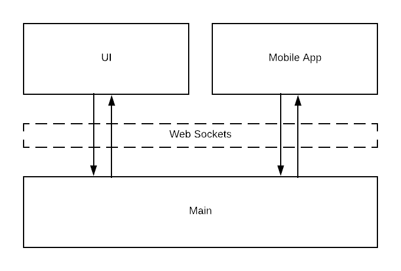
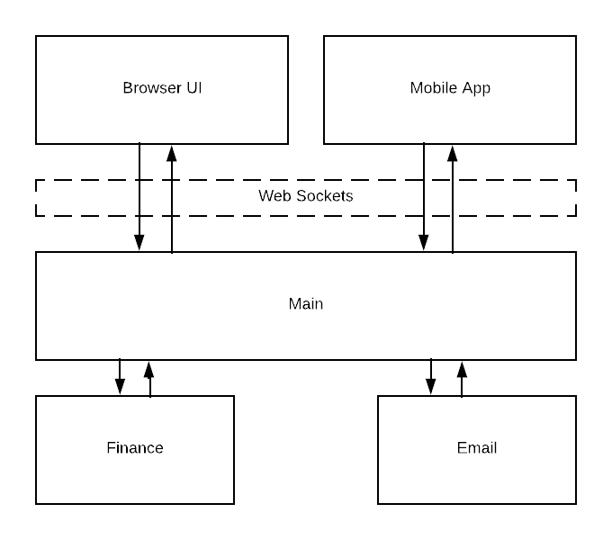
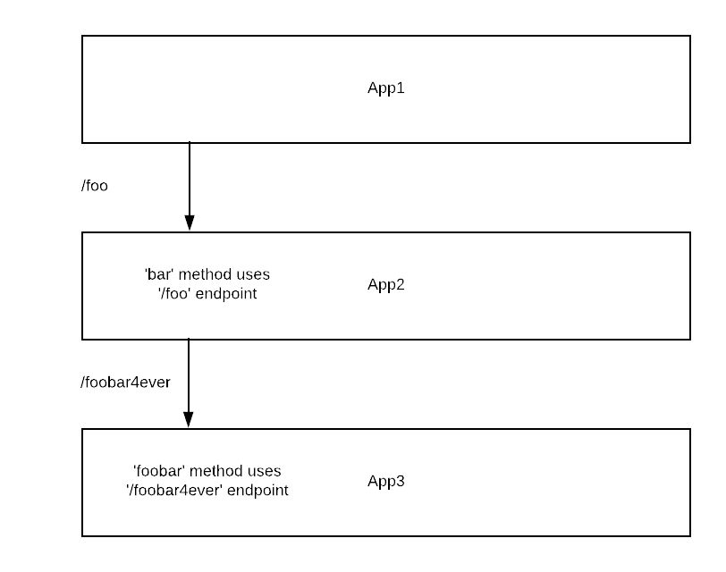
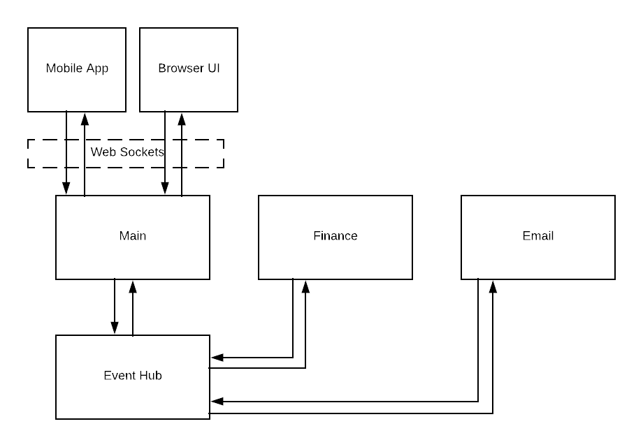
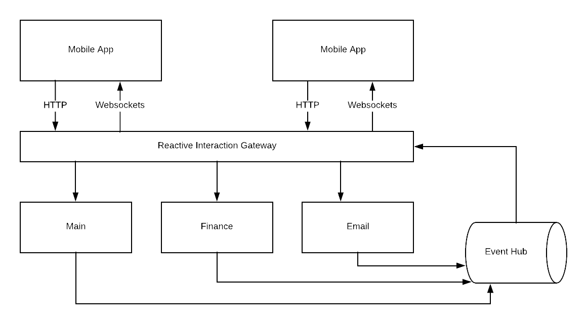
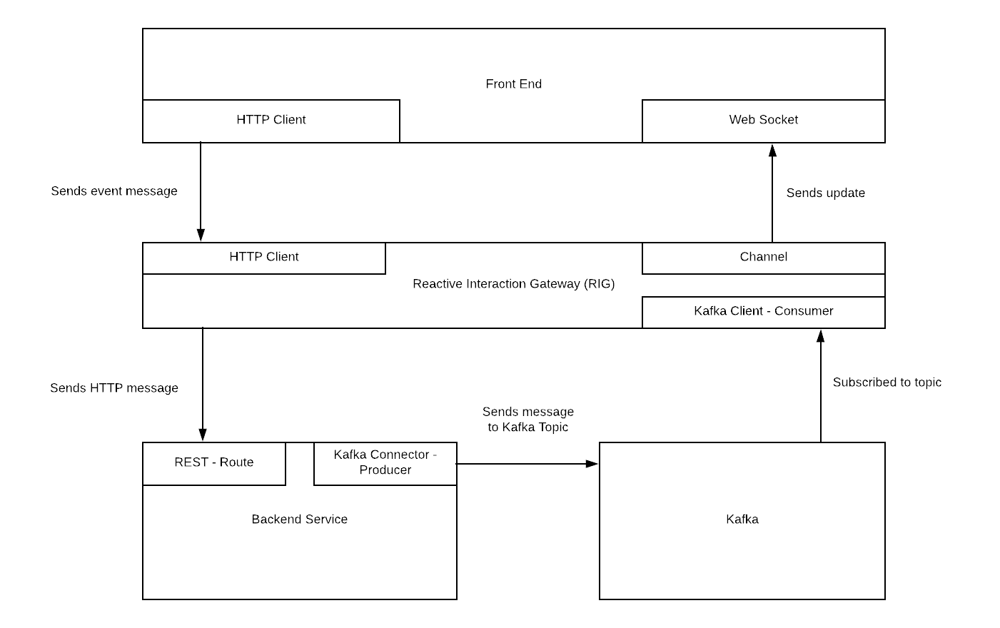

## Reactive Interaction Gateway: The Big Picture

**TL;DR:** In order to answer the “what, how, why” of the project, this document proposes a use case for real time updates, shows iterations of how to solve this problem architecturally, explains Reactive architecture, and presents where the Reactive Interaction Gateway fits into this architecture.

RIG is part of Accenture's contribution to the Reactive architecture community.

## Why we built RIG

Typically, an API gateway acts as a
[reverse proxy](https://en.wikipedia.org/wiki/Reverse_proxy), forwarding requests from
frontend to backend services. The backend services typically send back a reply, which
is then forwarded back to the client.

Quite often, you'd like your UI to display events as they occur (think "two customer's
are looking at this" on your favorite hotel-booking site). The simplest way to
implement this is by having the frontend poll a backend service for updates, but this
doesn't scale well - a lot of extra traffic and a single service that is coupled to
all services that emit interesting events.

The first problem is easy: to reduce traffic and get rid of potentially large
notification delays, you could also have your reverse proxy forward a websocket
connection, or something similar, to that backend service.

The approach so far works okay as long as you have a monolithic application, but fails
in a microservice environment: it's a single component coupled to most services in
your system as it asks them for updates - any change in any other service will affect
it. We can solve this problem by decoupling the services using some kind of messaging
service, like Kafka; now the backend-for-frontends service simply listens to the Kafka
stream, where all other services publish their events to.

This is exactly what RIG does: it subscribes to Kafka topics, while holding
connections to all active frontends, forwarding events to the users they're addressed
to, all in a scalable way. And on top of that, it also handles authorization, so your
services don't have to care about that either.

For integrating the event stream into frontends, RIG supports several options
(and additional transports are
[easy to implement](https://hexdocs.pm/phoenix/Phoenix.Socket.Transport.html)):
- [Server-Sent Events (SSE)](https://en.wikipedia.org/wiki/Server-sent_events)
- [WebSocket](https://en.wikipedia.org/wiki/WebSocket)
- HTTP long-polling

## Design goals

- Handling of huge numbers of active frontend connections simultaneously
- Easily and massively horizontally scalable
- Minimal impact on frontend code using open and established standards to choose from
  (SSE, WebSockets)
- Be resilient to faults
- Easy to use, simple to deploy (so far we managed to get away without external
  dependencies)

## Why polling is not the answer

The obvious thing to do is polling, which basically means hitting the server for updates, again and again. This is easy to implement and has the advantage of working everywhere, regardless of how old the browser or strange the firewall setup may be. However, there are also some downsides to it.

Imaging yourself in a project where you're building a website that's composed of many smaller (React) components, and most of them show a different part of the state tree. Some of them might even present the same data in different ways. How would you make sure the UI always shows the _most recent_ data, just like on the ticket vendor website outlined above? There is a trade-off here: either you have the top-level component update _all_ the data every few seconds (which might _still_ be too slow), or each component fetches the data it needs individually. Both approaches are less than ideal: fetching everything all the time causes loads of traffic. Most likely, you'll be overfetching, because some of the data you request will probably never change at all. Having each component fetch their own data sounds good at first, but it will cost you a lot in terms of performance and complexity (think loading indicators, handling debouncing, connection timeouts, synchronizing view state among components, ...).

From an architectural standpoint, your app generates a lot of unnecessary load that must be handled by the server, which means that your app cannot scale well with the number of users. Finally, each connection attempt may affect battery life when running on a mobile device.

## Use Case: Real Time Updates

You see a Twitter notification that The Glitch Mob is doing a pop-up concert two nights from now at a venue just a few blocks from your apartment. No way! Your long-distance partner loves The Glitch Mob and they’re in town for a visit this weekend.  

Working late at the client site, you quickly log on to the ticket vendor on your laptop and look to book tickets before your car to the airport arrives. 

You see the live map of the venue, seats disappearing before your eyes at an alarming rate. You grab two, get to payment processing, and the car pulls up. 

Switching to your phone, you pull up the app, continuing the checkout process, and book the tickets. The event sells out in the next few minutes. Success!

## Architectural Case
You’re tasked to architect an application setup that handles this functional requirement; a user can move seamlessly between mobile and browser experiences. It requires real time updates to the user interface.

We’ll start with the simplest form and then layer complexity into the model. We might see an architecture like this. A main backend application handles the business logic and maintains web socket connections to the web and mobile user interfaces.

User Story
- views tickets
- sees updates as tickets are reserved by other users
- pays for tickets
- reserves tickets
- receives email

Clearly, we’re missing the financial transaction. Let’s add that in as a microservice and use HTTP endpoints to handle the connection between the application.
 

We want to send an email to the user once the process is complete. It is common to stand up a microservice to handle sending emails. We’ll use HTTP connections from the main application to the email service.
 

## Microservices & The Challenge of Evolving Complexity
Following this progression over time, the architectural complexity increases as functional requirements grow and we build out a collection of interacting microservices. Enterprise scale traffic and data flow demands place great stress on an architecture like this. Thousands of messages are passed through each microservice at once.

In an environment that depends on real time updates, like buying tickets, load can increase dramatically at peak times. A crash or stalled process at those times leads to a bad user experience and threatens the business.

A microservice architecture has a lot of benefits but depending on the way that the messages are passed throughout the system and stateful dependencies are managed, it can be difficult to debug what goes wrong.

## Endpoints As Investment: Functionality Is Built on Data Sources
Building endpoints between the applications means that as complexity grows, it becomes more difficult to change the overall system. Other application features are built around the data from an endpoint and this locks together application interfaces. Each endpoint represents a long-term investment in a static architecture.

In this example, App1 exposes an endpoint `/foo`. App2 makes an API call for that data and builds a method `bar` on the received data. App2 then exposes an endpoint `/foobar4ever`that uses the `bar` method. It creates a method called `foobar`. 

While that's a simple and humorous example, this is a common situation in microservice architectures. As functionality is built out, each application is dependent on endpoints existing in another application.

To change and adapt the system requires changing the whole chain of methods and endpoints. As systems grow in complexity they become ossified. 

## Reactive Architecture
There is a community who has committed to a set of principles, the [Reactive Manifesto](https://www.reactivemanifesto.org/), that guide architectures to be able to handle the many challenges that arise from a microservice architecture at scale. This is known as Reactive Architecture.

_Only a few years ago a large application had tens of servers, seconds of response time, hours of offline maintenance and gigabytes of data. Today applications are deployed on everything from mobile devices to cloud-based clusters running thousands of multi-core processors. Users expect millisecond response times and 100% uptime. Data is measured in Petabytes. Today's demands are simply not met by yesterday’s software architectures._

Reactive Systems are:
- Responsive
- Resilient
- Elastic
- Message Driven

Here's a potential way of designing the previous architecture in line with Reactive principles by adding an event hub. Instead of using HTTP endpoints between individual applications, each application publishes the events they generate to a topic and subscribe to the topic with the event data they need. The data flow is organized with topics.
 

## Streaming Data Enables Flexibility and Adaptibility
Designing the architecture with message passing flows means that the structure of the architecture can be changed more freely. 

Imagining the flow of the data as representing the state of the system, applications can be inserted, added, or changed, rather than relying on HTTP endpoints between multiple applications that need updating at each new iteration. 

The architectural design is centered on streams of data through the system rather than the relationships and connections between applications. Data is sent asynchronously and applications react to events as they occur. This ability to think abstractly about streams of data as the system evolves regardless of the technical implementation is very valuable. 

Say the tickets endpoint was initially written in a language and framework that can’t handle the increased volume as it scales. It can be easily replaced, with the new application simply taking over the event subscription and publication to the topic. Topics can be easily updated.

A reactive architecture using an event hub like Kafka enables an increased flexibility and the ability to debug, monitor, and maintain the backend in a microservices architecture. Even so, something about this architecture feels disjointed and unaligned to Reactive principles because of the real time updates.

## Reactive Interaction Gateway
The application maintaining the websocket connections in our diagram will have trouble handling thousands of concurrent users with real time updates, whether they be mobile or browser based. 

At scale, this poses problems in the infrastructure and architecture. Events will need to be sent via the event hub and an application has to function as an interface with the client side. Which application should do it? Should the application that handles the main business logic also handle connections?

The Reactive Interaction Gateway (RIG) was designed to solve this problem elegantly and in line with Reactive principles. Using the Erlang VM, BEAM, we can model web socket connections using actors, which are much lighter weight than OS threads. 

RIG functions as an application interface layer and works as an event hub for the front end.  It powers real time updates and decouples the backend interface from the frontend while enabling many concurrent users. It handles asynchronous events streaming from the event hub or from the UI.

This architecture can evolve in complexity as features are built, adding or subtracting services in order to reflect the problem domain. It enables the continuous deployment of backend services without effecting users' connections.

RIG is designed to manage all connections to the front end and to be language agnostic. It does not matter in which framework or language a connecting application is written and developers do not need to know Elixir / Phoenix to use RIG. 

Routes are defined using a configuration file or by POSTing directly to the application. This gives an architect a great deal of flexibility to choose the tools they use to meet functional requirements.

## Next Layer of Complexity: A Reference Architecture
In the [/examples](https://github.com/Accenture/reactive-interaction-gateway/tree/master/examples) folder, there is an example architecture made with a React frontend, RIG, a Node backend, and a Kafka instance. Here's a chart demonstrating that reference architecture in abstract. Go to [/examples](https://github.com/Accenture/reactive-interaction-gateway/tree/master/examples) for more depth:

