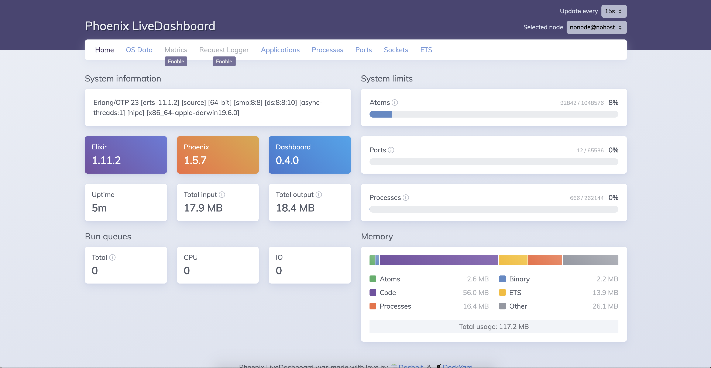

## Introduction

[Phoenix LiveDashboard](https://github.com/phoenixframework/phoenix_live_dashboard) provides real-time performance monitoring and debugging tools.

It's accessible at `:4010/dashboard`. All metrics are created via the same Prometheus metrics as those in the [Grafana dashboards](prometheus-metrics.md#grafana_dashboards).

## Phoenix LiveDashboard vs. Grafana

Phoenix LiveDashboard is a much simpler and quicker overview over the RIG (or any Elixir app). It provides metrics in real-time fashion, but only from the point when you open a given metric (it doesn't use any database). In addition it offers some Erlang/Elixir specific statistics/information which you won't find in the [Grafana dashboards](prometheus-metrics.md#Grafana_Dashboards).
